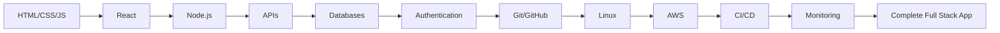

# 🌐 Phase 1: Full Stack Development

> Master the fundamentals of modern web development, from frontend to backend to DevOps.

## 📊 Phase Overview

**Duration:** 6-9 months  
**Difficulty:** Beginner to Intermediate  
**Prerequisites:** Basic computer literacy

## 🎯 Learning Objectives

By the end of this phase, you will be able to:

- ✅ Build responsive, interactive web applications
- ✅ Create RESTful APIs and backend services
- ✅ Work with databases and authentication
- ✅ Deploy applications to the cloud
- ✅ Implement CI/CD pipelines
- ✅ Monitor and maintain production applications

## 📚 Curriculum Structure

### 1. Frontend Development (2-3 months)

Learn to build beautiful, responsive user interfaces.

#### Topics Covered:
- [HTML](./01-frontend/html/README.md) - Structure and semantics
- [CSS](./01-frontend/css/README.md) - Styling and layouts
- [JavaScript](./01-frontend/javascript/README.md) - Programming fundamentals
- [React](./01-frontend/react/README.md) - Modern UI framework
- [Tailwind CSS](./01-frontend/tailwind/README.md) - Utility-first CSS

#### Checkpoints:
- ✅ **Checkpoint 1:** Build static webpages
- ✅ **Checkpoint 2:** Add interactivity with JavaScript
- ✅ **Checkpoint 3:** Create a complete frontend application

[📖 Start Frontend Development →](./01-frontend/README.md)

---

### 2. Backend Development (2-3 months)

Build robust server-side applications and APIs.

#### Topics Covered:
- [Node.js](./02-backend/nodejs/README.md) - JavaScript runtime
- [RESTful APIs](./02-backend/apis/README.md) - API design and development
- [Databases](./02-backend/databases/README.md) - PostgreSQL, Redis
- [Authentication](./02-backend/authentication/README.md) - JWT, OAuth

#### Checkpoints:
- ✅ **Checkpoint 4:** Build CLI applications
- ✅ **Checkpoint 5:** Create simple CRUD APIs
- ✅ **Checkpoint 6:** Build a complete full-stack application

[🔧 Start Backend Development →](./02-backend/README.md)

---

### 3. DevOps & Deployment (2-3 months)

Learn to deploy, monitor, and maintain applications in production.

#### Topics Covered:
- [Git & GitHub](./03-devops/git-github/README.md) - Version control
- [Linux Basics](./03-devops/linux/README.md) - Command line essentials
- [AWS Services](./03-devops/aws/README.md) - Cloud infrastructure
- [CI/CD](./03-devops/ci-cd/README.md) - Automation pipelines
- [Monitoring](./03-devops/monitoring/README.md) - Application monitoring

#### Checkpoints:
- ✅ **Checkpoint 7:** Deploy to production
- ✅ **Checkpoint 8:** Set up monitoring
- ✅ **Checkpoint 9:** Implement CI/CD
- ✅ **Checkpoint 10:** Automate infrastructure

[🚀 Start DevOps →](./03-devops/README.md)

---

## 🛠️ Tech Stack

### Frontend
```
HTML5 → CSS3 → JavaScript (ES6+) → React → Tailwind CSS
```

### Backend
```
Node.js → Express → PostgreSQL → Redis → JWT Auth
```

### DevOps
```
Git/GitHub → Linux → AWS → GitHub Actions → Terraform → Ansible
```

## 📋 Learning Path



## 🎓 Recommended Learning Approach

### Week-by-Week Breakdown

#### Weeks 1-4: HTML, CSS, JavaScript Basics
- Days 1-7: HTML fundamentals
- Days 8-14: CSS and responsive design
- Days 15-21: JavaScript basics
- Days 22-28: DOM manipulation and events

#### Weeks 5-8: Modern Frontend
- Days 29-35: npm and package management
- Days 36-49: React fundamentals
- Days 50-56: Tailwind CSS

#### Weeks 9-12: Backend Basics
- Days 57-70: Node.js and Express
- Days 71-84: RESTful API development

#### Weeks 13-16: Databases & Auth
- Days 85-98: PostgreSQL
- Days 99-112: Authentication and security

#### Weeks 17-20: DevOps Fundamentals
- Days 113-126: Git, GitHub, Linux basics
- Days 127-140: AWS services

#### Weeks 21-24: Advanced DevOps
- Days 141-154: CI/CD with GitHub Actions
- Days 155-168: Infrastructure as Code

## 💡 Project Ideas

### Beginner Projects
1. **Personal Portfolio Website**
   - HTML, CSS, JavaScript
   - Responsive design
   - Deploy to GitHub Pages

2. **Todo Application**
   - React frontend
   - Local storage
   - CRUD operations

### Intermediate Projects
3. **Blog Platform**
   - Full stack application
   - User authentication
   - CRUD for posts
   - Comments system

4. **E-commerce Store**
   - Product catalog
   - Shopping cart
   - Payment integration
   - Order management

### Advanced Projects
5. **Social Media Platform**
   - User profiles
   - Posts and comments
   - Real-time notifications
   - Image uploads
   - Search functionality

6. **Project Management Tool**
   - Team collaboration
   - Task management
   - Real-time updates
   - File attachments
   - Analytics dashboard

## 📚 Resources

### Official Documentation
- [MDN Web Docs](https://developer.mozilla.org/)
- [React Documentation](https://react.dev/)
- [Node.js Documentation](https://nodejs.org/docs/)
- [PostgreSQL Documentation](https://www.postgresql.org/docs/)
- [AWS Documentation](https://docs.aws.amazon.com/)

### Recommended Courses
- [freeCodeCamp](https://www.freecodecamp.org/)
- [The Odin Project](https://www.theodinproject.com/)
- [Full Stack Open](https://fullstackopen.com/)

### Books
- "Eloquent JavaScript" by Marijn Haverbeke
- "You Don't Know JS" series by Kyle Simpson
- "Node.js Design Patterns" by Mario Casciaro

## ✅ Phase Completion Checklist

Before moving to Phase 2, ensure you can:

- [ ] Build responsive websites with HTML, CSS, and JavaScript
- [ ] Create React applications with state management
- [ ] Develop RESTful APIs with Node.js and Express
- [ ] Work with PostgreSQL databases
- [ ] Implement JWT authentication
- [ ] Use Git for version control
- [ ] Deploy applications to AWS
- [ ] Set up CI/CD pipelines
- [ ] Monitor application performance
- [ ] Debug and troubleshoot issues

## 🎯 Next Steps

Once you complete Phase 1:

1. **Build a Capstone Project** - Combine all skills learned
2. **Review and Refactor** - Improve your earlier projects
3. **Prepare for Phase 2** - Review Python basics if needed
4. **[Start Phase 2: AI Engineering →](../02-ai-engineering/README.md)**

---

## 📞 Need Help?

- 💬 [Join Discussions](https://github.com/yourusername/repo/discussions)
- 🐛 [Report Issues](https://github.com/yourusername/repo/issues)
- 📧 [Contact Support](mailto:support@example.com)

---

[← Back to Main](../README.md) | [Frontend Development →](./01-frontend/README.md)