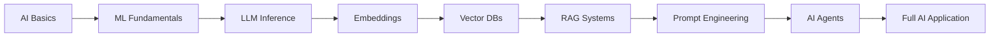

# 🤖 Phase 2: AI Engineering

> Build and integrate AI-powered features into applications using modern LLMs and AI tools.

## 📊 Phase Overview

**Duration:** 4-6 months  
**Difficulty:** Intermediate to Advanced  
**Prerequisites:** Phase 1 completed OR proficiency in Python/JavaScript

## 🎯 Learning Objectives

By the end of this phase, you will be able to:

- ✅ Understand AI/ML fundamentals and terminology
- ✅ Work with Large Language Models (LLMs)
- ✅ Implement embeddings and vector search
- ✅ Build RAG (Retrieval Augmented Generation) systems
- ✅ Master prompt engineering techniques
- ✅ Create autonomous AI agents
- ✅ Integrate AI into full-stack applications

## 📚 Curriculum Structure

### 1. AI Fundamentals (2-3 weeks)

Build foundational knowledge of AI and Machine Learning.

#### Topics Covered:
- [AI Basics](./01-fundamentals/ai-basics/README.md) - What is AI, applications, ethics
- [ML Basics](./01-fundamentals/ml-basics/README.md) - Core ML concepts
- [Terminology](./01-fundamentals/terminology/README.md) - Essential vocabulary

[📖 Start AI Fundamentals →](./01-fundamentals/README.md)

---

### 2. Large Language Models (4-6 weeks)

Master working with LLMs for various applications.

#### Topics Covered:
- [Inference](./02-llms/inference/README.md) - Running LLMs
- [Training](./02-llms/training/README.md) - Fine-tuning models
- [Embeddings](./02-llms/embeddings/README.md) - Vector representations

[🧠 Start LLMs →](./02-llms/README.md)

---

### 3. AI Tools & Frameworks (4-6 weeks)

Learn essential tools for building AI applications.

#### Topics Covered:
- [Vector Databases](./03-tools/vector-databases/README.md) - Pinecone, Weaviate, ChromaDB
- [RAG](./03-tools/rag/README.md) - Retrieval Augmented Generation
- [Prompt Engineering](./03-tools/prompt-engineering/README.md) - Effective prompts

[🛠️ Start AI Tools →](./03-tools/README.md)

---

### 4. AI Agents (3-4 weeks)

Build autonomous AI systems that can use tools and make decisions.

#### Topics Covered:
- Agent Architecture
- Tools & Function Calling
- Memory Systems
- Planning & Reasoning
- Multi-agent Systems

[🤖 Start AI Agents →](./04-agents/README.md)

---

## 🛠️ Tech Stack

### Languages & Frameworks
```
Python → LangChain → OpenAI API → Hugging Face
```

### LLM Providers
- OpenAI (GPT-4, GPT-3.5)
- Anthropic (Claude)
- Open Source (Llama, Mistral)

### Vector Databases
- Pinecone
- Weaviate
- ChromaDB
- Qdrant

### Tools & Libraries
- LangChain / LlamaIndex
- Hugging Face Transformers
- OpenAI SDK
- Vector DB SDKs

## 📋 Learning Path



## 💡 Project Ideas

### Beginner Projects

1. **AI Chatbot**
   - Simple Q&A bot
   - OpenAI API integration
   - Conversation history
   - **Time:** 5-8 hours

2. **Document Summarizer**
   - Upload documents
   - Generate summaries
   - Key points extraction
   - **Time:** 8-12 hours

### Intermediate Projects

3. **RAG-based Knowledge Base**
   - Document ingestion
   - Vector storage
   - Semantic search
   - Context-aware responses
   - **Time:** 15-20 hours

4. **AI Writing Assistant**
   - Multiple writing modes
   - Style customization
   - Grammar checking
   - Content generation
   - **Time:** 20-25 hours

### Advanced Projects

5. **AI-Powered Customer Support**
   - Multi-turn conversations
   - Intent classification
   - Ticket routing
   - Knowledge base integration
   - Analytics dashboard
   - **Time:** 30-40 hours

6. **Autonomous AI Agent**
   - Tool usage
   - Planning capabilities
   - Memory system
   - Multi-step reasoning
   - Error handling
   - **Time:** 40-50 hours

## 📚 Resources

### Official Documentation
- [OpenAI Documentation](https://platform.openai.com/docs)
- [LangChain Documentation](https://python.langchain.com/)
- [Hugging Face Documentation](https://huggingface.co/docs)

### Courses
- [DeepLearning.AI - LangChain Course](https://www.deeplearning.ai/short-courses/)
- [Fast.ai - Practical Deep Learning](https://course.fast.ai/)
- [Scrimba - AI Engineer Path](https://scrimba.com/)

### Books
- "Designing Machine Learning Systems" by Chip Huyen
- "Building LLM Applications" by Valentina Alto
- "Prompt Engineering Guide" (online)

### Communities
- [LangChain Discord](https://discord.gg/langchain)
- [Hugging Face Forums](https://discuss.huggingface.co/)
- [r/MachineLearning](https://reddit.com/r/MachineLearning)

## ✅ Phase Completion Checklist

Before moving to Phase 3, ensure you can:

- [ ] Explain AI/ML concepts clearly
- [ ] Work with LLM APIs (OpenAI, Anthropic)
- [ ] Generate and use embeddings
- [ ] Implement vector search
- [ ] Build RAG systems
- [ ] Write effective prompts
- [ ] Create AI agents with tools
- [ ] Handle errors and edge cases
- [ ] Optimize for cost and performance
- [ ] Deploy AI applications

## 🎯 Next Steps

Once you complete Phase 2:

1. **Build a Capstone AI Project**
2. **Contribute to open-source AI projects**
3. **Explore advanced topics** (fine-tuning, model optimization)
4. **[Start Phase 3: Software Architecture →](../03-software-architecture/README.md)**

---

## 💰 Cost Considerations

### API Costs
- OpenAI GPT-4: ~$0.03-0.06 per 1K tokens
- OpenAI GPT-3.5: ~$0.001-0.002 per 1K tokens
- Anthropic Claude: Similar to OpenAI

### Vector Database Costs
- Pinecone: Free tier available, paid plans from $70/month
- Weaviate: Self-hosted (free) or cloud
- ChromaDB: Free, open-source

### Tips to Minimize Costs
- Use GPT-3.5 for development
- Implement caching
- Optimize prompts
- Use open-source models when possible

---

[← Back to Main](../README.md) | [AI Fundamentals →](./01-fundamentals/README.md)