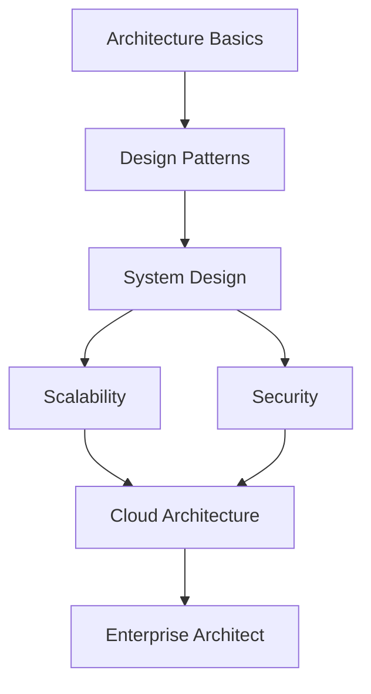

# 🏛️ Phase 3: Software Architecture

> Master the art of designing scalable, secure, and maintainable software systems at enterprise scale.

## 📊 Phase Overview

**Duration:** 6-12 months  
**Difficulty:** Advanced  
**Prerequisites:** Phase 1 & 2 completed OR 2+ years development experience

## 🎯 Learning Objectives

By the end of this phase, you will be able to:

- ✅ Design scalable distributed systems
- ✅ Apply architectural patterns effectively
- ✅ Make informed technical decisions
- ✅ Lead architecture discussions
- ✅ Document architecture decisions
- ✅ Balance trade-offs in system design
- ✅ Design for security and compliance
- ✅ Architect cloud-native applications

## 📚 Curriculum Structure

### 1. Architecture Basics (3-4 weeks)

Understand the fundamentals of software architecture.

#### Topics Covered:
- [What is Software Architecture](./01-basics/what-is-architecture/README.md)
- [Software Architect Role](./01-basics/architect-role/README.md)
- [Architecture Levels](./01-basics/levels/README.md)

[📖 Start Architecture Basics →](./01-basics/README.md)

---

### 2. Design Patterns (6-8 weeks)

Master common software design patterns and anti-patterns.

#### Topics Covered:
- Creational Patterns (Singleton, Factory, Builder)
- Structural Patterns (Adapter, Decorator, Facade)
- Behavioral Patterns (Observer, Strategy, Command)
- Architectural Patterns (MVC, MVVM, Microservices)
- Anti-patterns to Avoid

[🎨 Start Design Patterns →](./02-design-patterns/README.md)

---

### 3. System Design (8-12 weeks)

Learn to design large-scale distributed systems.

#### Topics Covered:
- Requirements Analysis
- High-Level Design
- Low-Level Design
- Capacity Planning
- Trade-off Analysis
- System Design Interviews

[🔧 Start System Design →](./03-system-design/README.md)

---

### 4. Scalability (6-8 weeks)

Build systems that can handle growth.

#### Topics Covered:
- Horizontal vs Vertical Scaling
- Load Balancing
- Caching Strategies
- Database Scaling
- Microservices Architecture
- Performance Optimization

[📈 Start Scalability →](./04-scalability/README.md)

---

### 5. Security Architecture (4-6 weeks)

Design secure systems from the ground up.

#### Topics Covered:
- Security Principles
- Authentication & Authorization
- Encryption & Data Protection
- OWASP Top 10
- Compliance (GDPR, HIPAA)
- Threat Modeling

[🔒 Start Security →](./05-security/README.md)

---

### 6. Cloud Architecture (6-8 weeks)

Master cloud-native architecture patterns.

#### Topics Covered:
- Cloud Design Patterns
- Serverless Architecture
- Container Orchestration
- Multi-cloud Strategies
- Cost Optimization
- Cloud Best Practices

[☁️ Start Cloud Architecture →](./06-cloud-architecture/README.md)

---

## 🛠️ Architecture Toolkit

### Design Tools
- Draw.io / Lucidchart
- PlantUML
- Miro / Mural
- C4 Model

### Documentation
- Architecture Decision Records (ADRs)
- System Design Documents
- API Documentation
- Runbooks

### Frameworks & Methodologies
- TOGAF
- Zachman Framework
- 4+1 Architectural View Model
- C4 Model

## 📋 Learning Path

## 💡 Architecture Projects

### Project 1: E-Commerce Platform (Intermediate)
**Goal:** Design a scalable e-commerce system

**Requirements:**
- User management
- Product catalog
- Shopping cart
- Payment processing
- Order management
- Inventory system

**Architecture Focus:**
- Microservices
- Event-driven architecture
- Caching strategy
- Database design

**Time:** 20-30 hours

---

### Project 2: Social Media Platform (Advanced)
**Goal:** Design a Twitter/Instagram-like platform

**Requirements:**
- User profiles
- Posts/tweets
- Follow system
- News feed
- Notifications
- Search functionality
- Media storage

**Architecture Focus:**
- Scalability
- Real-time updates
- CDN strategy
- Database sharding

**Time:** 30-40 hours

---

### Project 3: Video Streaming Service (Expert)
**Goal:** Design a Netflix-like platform

**Requirements:**
- Video upload & processing
- Adaptive streaming
- Recommendation engine
- User management
- Analytics
- Global distribution

**Architecture Focus:**
- CDN architecture
- Microservices
- Data pipeline
- ML integration
- Cost optimization

**Time:** 40-60 hours

---

### Project 4: Cloud Migration Strategy (Expert)
**Goal:** Plan migration of legacy system to cloud

**Requirements:**
- Current state analysis
- Target architecture
- Migration strategy
- Risk assessment
- Cost analysis
- Timeline & phases

**Architecture Focus:**
- Cloud patterns
- Migration strategies
- Risk management
- Change management

**Time:** 30-50 hours

## 📚 Resources

### Books
- "Software Architecture: The Hard Parts" by Neal Ford
- "Designing Data-Intensive Applications" by Martin Kleppmann
- "Clean Architecture" by Robert C. Martin
- "Building Microservices" by Sam Newman
- "System Design Interview" by Alex Xu

### Online Resources
- [System Design Primer](https://github.com/donnemartin/system-design-primer)
- [Awesome Software Architecture](https://github.com/simskij/awesome-software-architecture)
- [Architecture Weekly](https://www.architecture-weekly.com/)

### Courses
- [Grokking the System Design Interview](https://www.educative.io/courses/grokking-the-system-design-interview)
- [Software Architecture & Design](https://www.udacity.com/course/software-architecture-design--ud821)

### Blogs & Newsletters
- [High Scalability](http://highscalability.com/)
- [Martin Fowler's Blog](https://martinfowler.com/)
- [Netflix Tech Blog](https://netflixtechblog.com/)
- [Uber Engineering Blog](https://eng.uber.com/)

### Communities
- [Software Architecture Slack](https://softwarearchitecture.slack.com/)
- [r/softwarearchitecture](https://reddit.com/r/softwarearchitecture)

## 🎓 Architecture Principles

### 1. SOLID Principles
- **S**ingle Responsibility
- **O**pen/Closed
- **L**iskov Substitution
- **I**nterface Segregation
- **D**ependency Inversion

### 2. CAP Theorem
- **C**onsistency
- **A**vailability
- **P**artition Tolerance

### 3. Design Principles
- DRY (Don't Repeat Yourself)
- KISS (Keep It Simple, Stupid)
- YAGNI (You Aren't Gonna Need It)
- Separation of Concerns
- Principle of Least Surprise

## ✅ Phase Completion Checklist

Before considering yourself a Software Architect, ensure you can:

- [ ] Design systems for 1M+ users
- [ ] Choose appropriate architectural patterns
- [ ] Make and document technical decisions
- [ ] Estimate system capacity and costs
- [ ] Design for security and compliance
- [ ] Lead architecture reviews
- [ ] Mentor junior developers
- [ ] Communicate with stakeholders
- [ ] Balance technical and business needs
- [ ] Stay updated with industry trends

## 🎯 Career Path

### Junior Architect (0-2 years)
- Assist in architecture design
- Document decisions
- Learn from senior architects

### Software Architect (2-5 years)
- Design system components
- Lead technical discussions
- Make architecture decisions

### Senior Architect (5-10 years)
- Design enterprise systems
- Define technical strategy
- Mentor other architects

### Principal/Chief Architect (10+ years)
- Set technical vision
- Influence industry standards
- Lead multiple teams

## 🏆 Next Steps

Congratulations on completing the Software Solution Engineer Learning Path!

### Continue Learning:
1. **Specialize** in a domain (FinTech, HealthTech, etc.)
2. **Contribute** to open-source projects
3. **Speak** at conferences and meetups
4. **Write** technical blogs and articles
5. **Mentor** junior developers
6. **Stay Current** with emerging technologies

### Advanced Topics:
- Quantum Computing
- Edge Computing
- Blockchain Architecture
- IoT Systems
- Real-time Systems

---

## 📞 Need Help?

- 💬 [Architecture Discussions](https://github.com/yourusername/repo/discussions)
- 🐛 [Report Issues](https://github.com/yourusername/repo/issues)
- 📧 [Contact](mailto:support@example.com)

---

[← Back to Main](../README.md) | [Architecture Basics →](./01-basics/README.md)